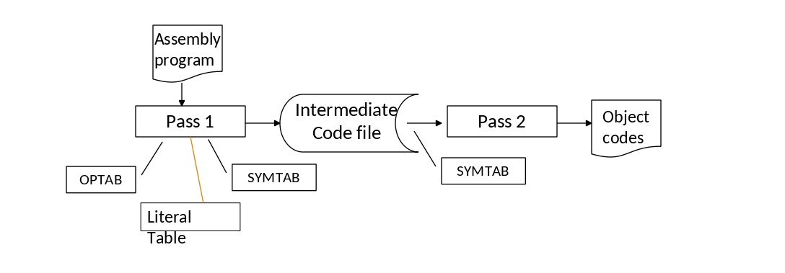

[TOC]


### To Do

- [ ] execute subroutine from MOT file instead of program files
- [ ] To pass support argument pass for main program (asm = sample.asm and ltorgmode = False)
- [ ] LTORG support
  - [ ] Support Ltorg mode by changing a Variable

- [ ] comment can be at the end of line with statements
- [ ] To implement operands checker for each Mnemonics
  - [ ] Implement Protected Symbols(LT LE ET GE GT for jump). Mnemonics are already protected as 

- [ ] Separate leftover LC Processing from assembly file reader
- [x] ~~Learn Hyperlinking within markdown file~~


## <u>Assembler Design</u>

1. It is 2 pass Assembler

   

   

   

### Program Files

#### 	MOT table reader

1. it reads mot table - which is in file format TSV (tab separated values)

2.  provides functions 

   1. For getting other values from given Mnemonics 

   2. Checking if Mnemonics is valid or not

   3. Return dict with all attributes of given Mnemonics

      ```python
      def get_Mnemonics_attribute(mnemonic :str , attribute = 'Size'):
      def isMnemonics(mnemonic: str):
      def return_given_mnemonics_dict(mnemonic :str):
      ```

### Pass 1 Files

#### 	Assembly File Reader

1. It reads Assembly (asm) file .
2. True 1 pass reader
   1. It reads by iterator so each line is only read once thought out whole program
3. Supports Comments
   1. Comment line start with "#" .
   2. there can be white space before "#"
4. Supports Empty Line
5. Splits the Statement into Label , Mnemonics , Operand1 and Operand2 fields
6. [Error Checks Each line](#Single line Error correction)
7. [Error checks some overall Structure](#Whole ASM program error correction)


#### 	LC Processing

1. Supports `START` and `START 200` like commands
2. Supports `ORG` commands
3. Deals with `DC` and `DS` Statement

### Pass 2 Files

------


### Assembly Language reference

### 	Statements

Standard Statements - `Label: Menmonics Operand1, Operand2`

or  `[Label[:] ]Menmonics[ Operand1[, Operand2]]` where `[]` fields are Optional


### 	Error Checking

#### 		Whole ASM program error correction

1. `START` must be first command

#### 		Single line Error correction

1. List line No  of the command with error, in Exception reporting


#### line splitting

```
START 200
NEXT: ADD AREG, BREG
SUB AREG, NUMBER
ADD BREG , 5

JUMP NEXT
NUMBER DC 5
CONS1 DC 1
ARRAY DS 10
END
```

#### line format

| Label                                      | Mnemonics   | operand1                                                         | operand2                                   |
| ------------------------------------------ | ----------- | ---------------------------------------------------------------- | ------------------------------------------ |
| [Label[:] ]                                | Mnemonics   | [operand1]                                                       | [, operand2]                               |
| Anylength                                  | max4letters | Anylength                                                        | Anylength                                  |
| Alphanumeric(must start with letter or __) | Aplhabets   | Alphanumeric(must start with letter or __) or number or [symbol] | Alphanumeric(must start with letter or __) |
|                                            |             |                                                                  |                                            |

#### Operation type

1. In all IS staements  only **Operand1** changes **if any**

##### Type - IS 2oprands

eg MOVE A , B

operand1 must be label or Register

​					

| Operrand 1                | Operand 2               |
| ------------------------- | ----------------------- |
| Label(address)or Register | label register constant |

